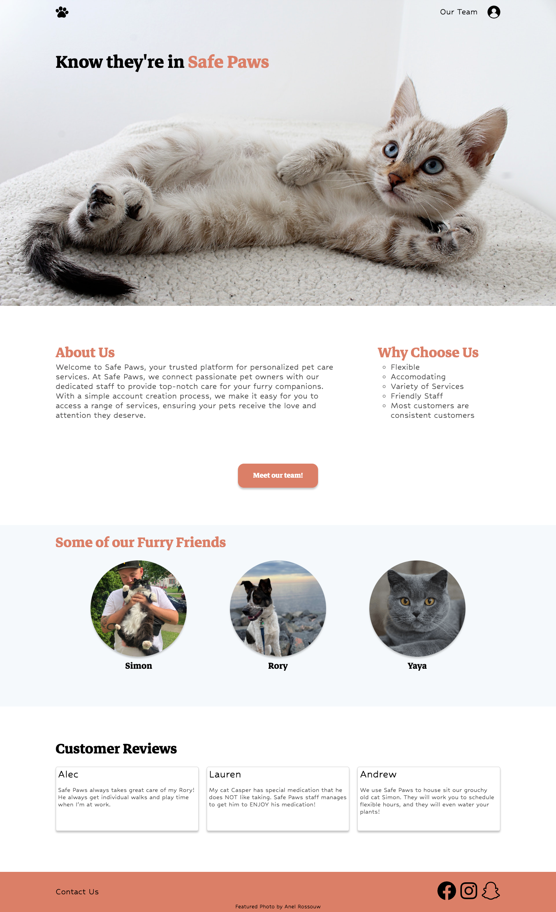
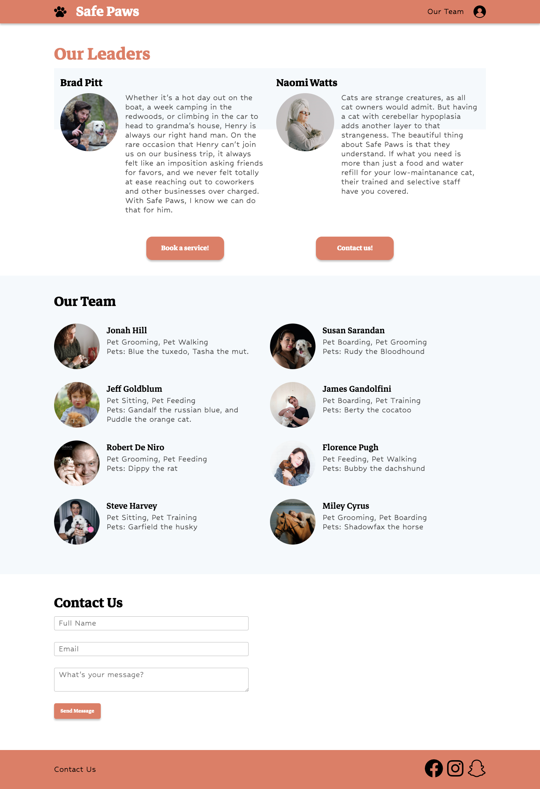
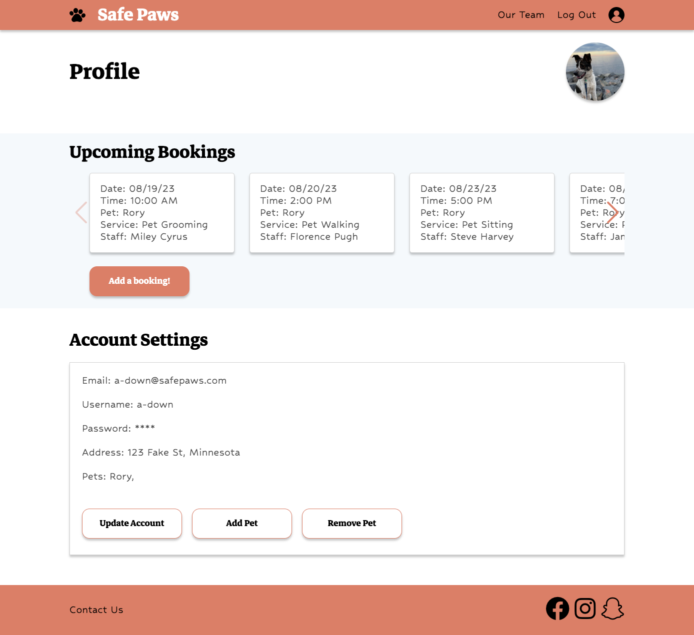
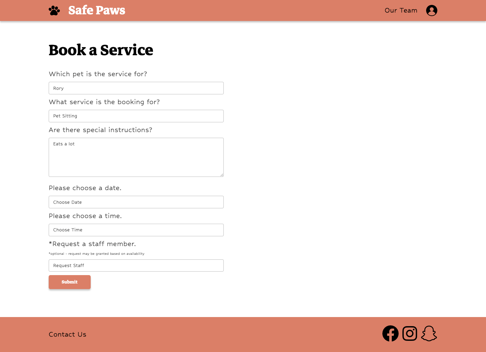
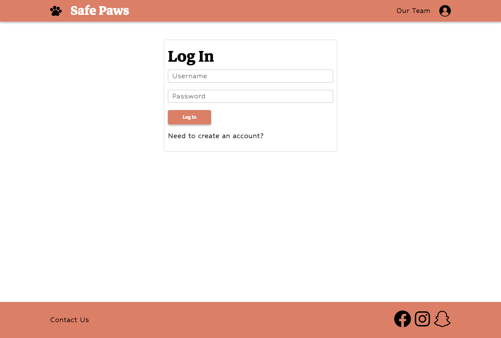
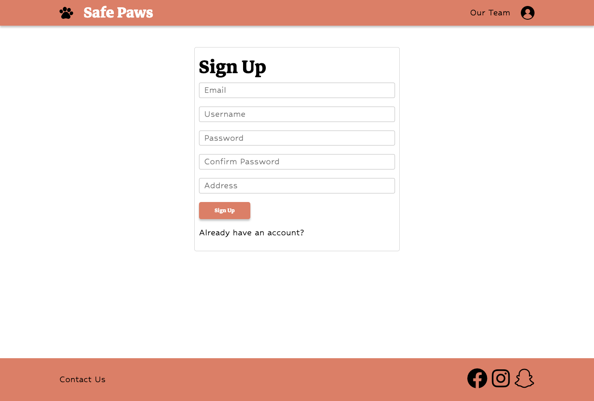

# Safe Paws (Group Project 2)

## Group Members
  - Andrew Erickson
  - Yaya Nur
  - Lauren Bleyl
  - Alec Downing

## MVP

The goal was to create a website for users to log in, add their pets, and schedule services for their pets. Our MVP was:
  - the user can log in
  - the user can save their pets’ information
  - the user can browse services and people that do those services
  - the user can book a service by choosing a worker, the service, the pet receiving the service, and a date and time within the next week
  - the user can see their booked services
  - the user can view their profile and pets
  - the user can view the profile of a worker and their related services
  - the homepage details the site, lists available services, and has a link to a login/signup

## Usage Instructions

1. Visit the website deployed on Heroku.

2. Use the ```profile icon``` in the upper-right corner to login/signup. 

3. Create an account.

4. Log in and you will be brought to the profile page.

5. Use the ```"Add pet!"``` button to add a pet to your profile.

6. After creating a pet, you can use the ```"Book a service!"``` button to navigate to the booking form to schedule a service.

7. Complete the form to schedule a booking.

8. Return to the profile page, and you will see the scheduled booking in the "Upcoming Bookings" section.

  ```md
  (you will not be able to access the "Profile" page or the "Booking" page unless you are signed in)
  ```


## Visual Examples

### Homepage


### Staff Page


### Profile Page


### Booking Page


### Login/Signup Page




## Deployed Application (Heroku)

[Deployed Application on Heroku](https://safe-paws-da967720d734.herokuapp.com/)

## Photo Sources

Hero Image, Leaders Images, and Staff Images are from [pexels.com](https://www.pexels.com)